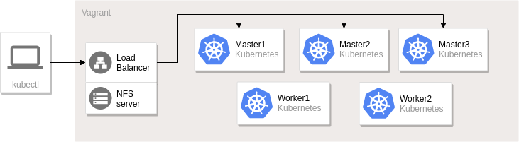
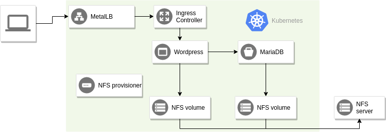

# README

This folder contains a Vagrantfile to set up a local kubernetes cluster.
Ansible is used for provisioning (see `playbooks`).

## Quick start

The cluster nodes are created by running `vagrant up --provider libvirt`.

You can then run the playbooks to install Kubernetes from the host, do it like this:
```
ansible-playbook playbooks/provision-all.yml
```
There is no need to specify the inventory since it is already configured in
`ansible.cfg`.

Once ansible is finished provisioning you can access the cluster from the control-plane1 node or from the nfs server.
Example:
```
$ vagrant ssh nfs
$ kubectl get nodes
NAME             STATUS   ROLES           AGE     VERSION
control-plane1   Ready    control-plane   4m42s   v1.24.2
control-plane2   Ready    control-plane   3m21s   v1.24.2
control-plane3   Ready    control-plane   98s     v1.24.2
worker1          Ready    <none>          64s     v1.24.2
worker2          Ready    <none>          77s     v1.24.2
```

## Requirements

- [Vagrant](https://www.vagrantup.com/)
- [Libvirt](https://libvirt.org/) OR [Virtualbox](https://www.virtualbox.org/)
- [Ansible](https://www.ansible.com/) >= 2.6

If you want to use vagrant with the libvirt provider, make sure you set up
libvirt with KVM first and install the `vagrant-libvirt` plugin.
Instructions for setting up libvirt with KVM on Ubuntu can be found [here](https://help.ubuntu.com/community/KVM/Installation).
The `vagrant-libvirt` plugin can be found [here](https://github.com/vagrant-libvirt/vagrant-libvirt).

## Architecture

Vagrant is used to create virtual machines according to the specification in
the `Vagrantfile`. These machines are then provisioned using ansible playbooks
to form a Kubernetes cluster, NFS server and load balancer. The architecture
is similar to this diagram.



Note that the default configuration only has a single control-plane node.

## Options

There are multiple ways to configure the vagrant cluster. This section describes
some of the possibilities, but by no means all of them.

Check the `examples` folder for some example configurations. It contains
inventory files ending with `.ini` and vagrant files starting with
`Vagrantfile`. If you wish to try one of the examples, replace the `Vagrantfile`
with the example vagrant file (e.g. `mv examples/Vagrantfile.ha Vagrantfile`).
It is already configured to use the corresponding example inventory.

### Operating system

You can choose between Ubuntu and CentOS as operating system for the nodes.
Simply uncomment the vagrant box you want to use in the `Vagrantfile`:
```ruby
config.vm.box = "generic/centos9s"
# config.vm.box = "generic/ubuntu2204"
```
OR add the box in the `hosts` hash (see `worker2` and `worker3`):
```ruby
hosts = {
    "control-plane1" => { "memory" => 1536, "ip" => "192.168.10.10"},
    "worker1" => { "memory" => 1536, "ip" => "192.168.10.30"},
    "worker2" => { "memory" => 1536, "ip" => "192.168.10.31", "box" => "generic/ubuntu2204"},
    "worker3" => { "memory" => 1024, "ip" => "192.168.10.32", "box" => "generic/ubuntu2204"},
    "nfs" => { "memory" => 512, "ip" => "192.168.10.20"}
}
```

### High availability control plane

The provided playbooks support setting up a HA control plane for kubernetes.
You will need at least three control-plane nodes configured both in the `Vagrantfile` and in the inventory file.
Additionally, you probably want to set up an external client instead of relying on one of the control-plane machines for talking to the API.
You can for example use the nfs/loadbalancer machine.
See `examples/ha.ini` and `examples/Vagrantfile.ha` for an example on how to configure this.

## Ops Scenarios

A number of scenarios with instructions and commands are available in the
`scenarios` folder.

- [upgrading k8s](scenarios/upgrading-k8s.md)
- [downgrading k8s](scenarios/downgrading-k8s.md)
- [upgrading OS and packages](scenarios/upgrading-os.md)
- [add worker node](scenarios/add-worker.md)
- [backup & restore](scenarios/backup-restore.md)

## Test application: wordpress

The vagrant environment contains a wordpress deployment to simulate a workload.
Add `192.168.10.40 example.com wordpress.example.com` to `/etc/hosts` in order
to access wordpress at `wordpress.example.com`. Or maybe [set up dnsmasq](https://www.linux.com/learn/intro-to-linux/2018/2/advanced-dnsmasq-tips-and-tricks)
to resolve the whole kube-ops domain to the IP address of the ingress
controller.

See `playbooks/templates/wordpress-values.yaml.j2` for configuration values.
The login credentials are `kube-ops:p455w0rd` at http://wordpress.example.com/wp-admin.

There are a few other components deployed in the cluster as base infrastructure.

- [nfs-client-provisioner](https://hub.kubeapps.com/charts/stable/nfs-client-provisioner)
for persistent volume provisioning
- [nginx-ingress](https://hub.kubeapps.com/charts/stable/nginx-ingress) as
ingress controller
- [metallb](https://hub.kubeapps.com/charts/stable/metallb) as load balancer

Here is a diagram describing how a request flows through the system.



The metalLB is configured to use IP addresses from `192.168.10.40` to
`192.168.10.50`. Since the nginx ingress controller is the first and only
application in the cluster with a service of type LoadBalancer, it will get the
IP address `192.168.10.40`.

The NFS provisioner is responsible for creating persistent volumes from the NFS
server. It polls the API server for new persistent volume claims and creates
a new volume as soon as it detects a new claim.

## Issues to be aware of

- There is a [bug](https://github.com/kubernetes/kubernetes/issues/55713)
that causes pods to remain in unknown state on nodes that are not ready, if they
have volumes attached.
    - [shutdown taint issue](https://github.com/kubernetes/kubernetes/issues/58635)
- Helm does not automatically update repository information. Make sure you get
the version you want of all charts, and if needed run `helm repo update`.
- Be careful what you wish for: pod disruption budgets won't stop nodes from
going down, but they will prevent you from evicting pods!
- Backing up only etcd data and root certificate is not enough. Old secrets
(tokens) will not be valid and cause applications to fail. (Kube-proxy is one
example.)
- Coredns is running on the control-plane at first. This will make all pods loose
DNS if/when the control-plane goes down. If the coredns pods are moved to some other
node (by killing them after other nodes have joined) all applications will
continue to operate normally when the control-plane goes down.
- Vagrant may occasionally try to run the ansible provisioner for all VMs. If
this happens, just `Ctrl + C` and start it again with `vagrant provision`.
(You'll notice this by looking for duplicate tasks and output.)
